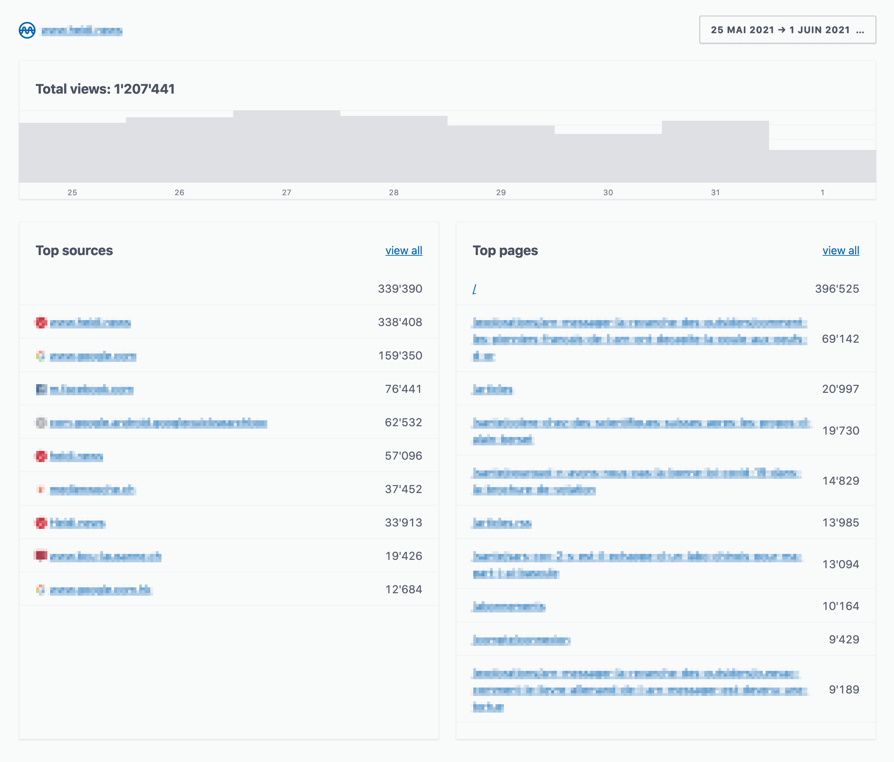

# ActiveAnalytics


Simple traffic analytics for the win of privacy.

* NO cookies
* NO JavaScript
* NO third parties
* NO bullshit

**ActiveAnalytics** is a Rails engine directly mountable in your Ruby on Rails application. It doesn't reveal anything about specific visitors. It cannot be blocked by adblockers or other privacy-protecting extensions (and doesn't need to).

**ActiveAnalytics** lets you know about:

* **Sources**: What are the pages and domains that bring some traffic.
* **Page views**: What are the pages that are the most viewed in your application.
* **Next/previous page**: What are the entry and exit pages for a given page of your application.



## Installation
Add this line to your application's Gemfile:
```ruby
gem 'active_analytics'
```

Then execute bundle and run the migration:
```bash
bundle
rails active_analytics:install:migrations
rails db:migrate
```

Your controllers have to call `ActiveAnalytics.record_request(request)` to record page views:
```ruby
class ApplicationController < ActionController::Base
  before_action :record_page_view

  def record_page_view
    # Add a condition to record only your canonical domain
    # and use a gem such as crawler_detect to skip bots.
    ActiveAnalytics.record_request(request)
  end
end
```

This is a basic `before_action`. In case you don't want to record all page views, simply define a `skip_before_action :record_page_view` in the relevant controller.

Finally, just add the route to ActiveAnalytics dashboard at the desired endpoint:
```ruby
mount ActiveAnalytics::Engine, at: "analytics"  # http://localhost:3000/analytics
```

## Authentication and permissions
ActiveAnalytics cannot guess how you handle user authentication, because it is different for all Rails applications. So you have to inject your own mechanism into `ActiveAnalytics::ApplicationController`. Create a file in `config/initializers/active_analytics.rb`:

```ruby
require_dependency "active_analytics/application_controller"

module ActiveAnalytics
  class ApplicationController
    # include Currentuser           # This is an example that you have to change by
    # before_action :require_admin  # your own modules and methods
  end
end
```

## License
The gem is available as open-source under the terms of the [MIT License](https://opensource.org/licenses/MIT).

Made by [Base Secrète](https://basesecrete.com).

Rails developer? Check out [RoRvsWild](https://rorvswild.com), our Ruby on Rails application monitoring tool.